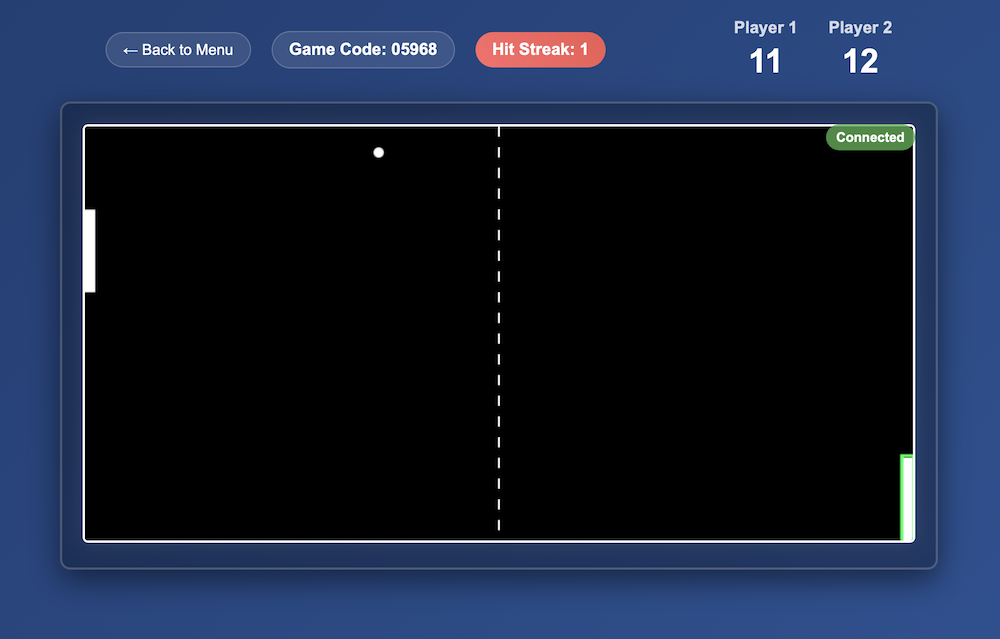

# Pongo



## Overview

Pong written in Go and vanilla JS.

## Features

- Create a game and share the code
- Or join an existing game if you know the code
- Track the hit streak and your score
- The ball moves faster and faster as the streak increases

## Requirements

- Go 1.24

## Setup

```commandline
go mod tidy
```

## Run locally

Run locally and watch for file changes.  
Visit http://localhost:8080 to play.

```commandline
make watch
```
